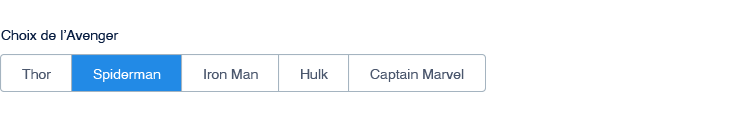

# Forms

## Text input

- __Inputs' width should match the type of data__ entered by the end user if possible.
- __Avoid full width text inputs__, textarea included. It's too hard to read and messy.

### Examples

Don't

Full-width forms are harder to fill. \
Dropdown's arrow isn't visible at first glance. \
It's hard to read the description in the textarea.

 

Do

It's easier to use forms that seem to be suited for the kind of data the user has to fill in. \
Dropdown is more obvious. \
The description in the text area is now readable.

## Segmented control

Segmented control is a great way to let the user choose between __2 to 5 options__.

## Toggle Switch

The switch can be used in order to replace 2 radio buttons or 2 options in a segmented control. \
\
⚠ __Toggle switch preferably must be used if the action takes effect immediately__, without having to click on a *save* button.

## Dropdown

For a larger list (> 5 options), use a dropdown. \
Do not forget the default placeholder.

