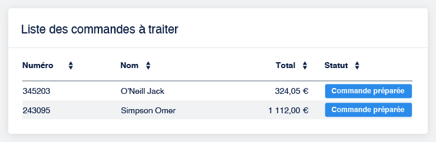
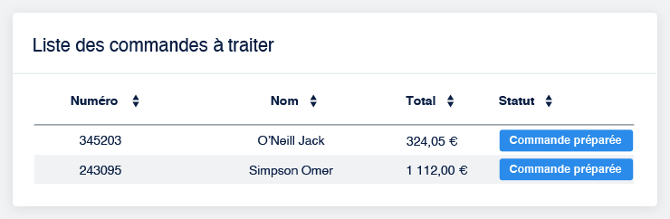

# Data-tables

## Alignment

In order to increase readability, please __choose the right alignment for each type of data__. \
Headers should be aligned with corresponding content.

| Data type | Alignment |
| --- | --- |
| Textual | Left |
| Label | Left |
| Date | Left |
| In doubt ? | Left |
| Numerical | Right |

### Examples

Do

This is a great consistant table. Figures are easily comparable.

 

Don't

Every time you center-align an element in a table, a kitten dies.