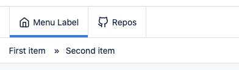

# Breadcrumb





## push

```php
/**
* Push new item to current breadcrumb
*
* @param string $label Menu's label
* @param string $route Either route name or full url
*
* @return \Webup\LaravelHelium\Core\Classes\HeliumBreadcrumb
*/
public function push(string $label, string $route);
```

### Examples

```php
Helium::breadcrumb()->push("First item","admin.home");
// Later in another function
Helium::breadcrumb()->push("Second item","admin.home");
```

Will produce 
