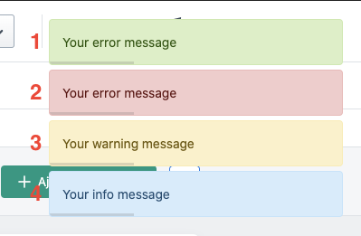

# Flash



1) [Success](#success)
2) [Error](#error)
3) [Warning](#warning)
4) [Info](#info)


## success
```php
/**
* Add success Toaster
*
* @param string $message Message diplayed
*
* @return \Webup\LaravelHelium\Core\Classes\HeliumFlash
*/
public function success(string $message);
```
### Example
```php
Helium::flash()->success("Your success message");
```


## error
```php
/**
* Add error Toaster
*
* @param string $message Message diplayed
*
* @return \Webup\LaravelHelium\Core\Classes\HeliumFlash
*/
public function error(string $message);
```
### Example
```php
Helium::flash()->error("Your error message");
```


## warning
```php
/**
* Add warning Toaster
*
* @param string $message Message diplayed
*
* @return \Webup\LaravelHelium\Core\Classes\HeliumFlash
*/
public function warning(string $message);
```
### Example
```php
Helium::flash()->warning("Your warning message");
```


## info
```php
/**
* Add info Toaster
*
* @param string $message Message diplayed
*
* @return \Webup\LaravelHelium\Core\Classes\HeliumFlash
*/
public function info(string $message);
```
### Example
```php
Helium::flash()->info("Your info message");
```

