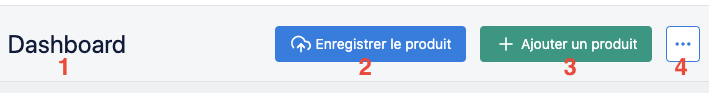

# Header



1) [Title](#title)
2) [Save button](#save)
3) [Add button](#add)
4) [Contextual actions](#contextual)


## title
```php
/**
* Set title
*
* @param string $title Header's title
*
* @return \Webup\LaravelHelium\Core\Classes\HeliumHeader
*/
public function title(string $title);
```
### Example
```php
Helium::header()->title("Dashboard");
```


## save
```php
/**
* Set save action
*
* @param string $label Save button label
* @param string $formId Id of saving form
*
* @return \Webup\LaravelHelium\Core\Classes\HeliumHeader
*/
public function save(string $label, string $formId);
```
### Example
```php
Helium::header()->save("Enregistrer le produit","admin.home");
```


## add
```php
/**
* Set add action
*
* @param string $label Add button label
* @param string $route Either route name or full url
*
* @return \Webup\LaravelHelium\Core\Classes\HeliumHeader
*/
public function add(string $label, string $route);
```
### Example
```php
Helium::header()->add("Ajouter un produit","admin.home");
```


## contextual
```php
/**
* Set contextual actions
*
* Example usage:
* Helium::header()->contextual([
*      "Action label" => [
*          "route" => "https//mydomain.com",
*          "danger" => true,
*          "data-attr" => "foo"
*      ]
* ]);
*
* @param array $actions Contextual actions

* @return \Webup\LaravelHelium\Core\Classes\HeliumHeader
*/
public function contextual(array $contextualActions);
```

### Example
```php
Helium::header()->contextual([
    //Simplest item
    "Item 1" => "admin.home",
    //Simple item
    "Item 2" => [
        "route" => "admin.home",
        "class" => "custom-css-class",
    ],
    //Danger item
    "Danger item" => [
        "route" => "admin.home",
        "danger" => true,
        "data-confirm" => "Are you sure ?",
    ],
    //Warning item
    "Warning item" => [
        "onclick" => "alert('Custom message')",
        "warning" => true,
    ],
    //Another simple item
    "Item 3" => "https://github.com/agence-webup/laravel-helium",
]);
```
#### Notes

1) **Items are sorted automatically through their dangerousness.**

From the example above

| Expectation   |               |  Reality     |
| ------------- |:-------------:| ------------:|
| Item 1        |               | Item 1       |
| Item 2        |               | Item 2       |
| Danger item   |       VS      | Item 3       |
| Warning item  |               | Warning item |
| Item 3        |               | Danger item  |


2) **Some nested keys are reserved or forbidden.**

Reserved : 
- route (string)
- class (string)
- danger (boolean)
- warning (boolean)

Forbidden:
- style (will be ignored)

